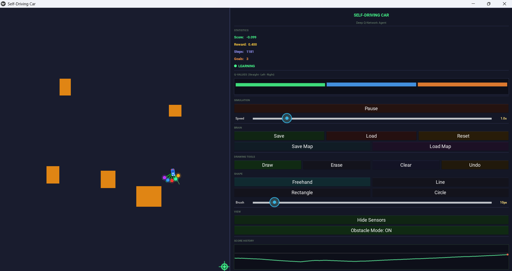

# Self-Driving Car — Deep Q-Network

A 2D self-driving car simulation powered by a Deep Q-Network (DQN) reinforcement learning agent. Draw obstacles on a canvas, watch the car learn to navigate between alternating goal points while avoiding the sand you've painted.

Built with **Python**, **PyTorch**, **Kivy**, and **NumPy**.



---

## Features

### Reinforcement Learning
- **Double DQN** — decouples action selection from value estimation to reduce overestimation bias
- **Dueling Network Architecture** — separates state-value and advantage streams for more stable learning
- **Prioritized Experience Replay (PER)** — learns more from surprising transitions using a SumTree for O(log n) sampling
- **Reward shaping** — distance-delta rewards guide the agent toward the goal instead of sparse terminal rewards
- **Speed bonus** — extra reward for reaching the goal quickly, decaying with step count
- **Softmax exploration** — temperature-annealed action sampling

### Environment
- **5 distance sensors** read local sand density in 5 directions
- **Full map awareness** — the sand map is downsampled to 16×16 and fed to the network alongside car position
- **Obstacle Mode** — automatically spawns new random obstacles every 3 goals reached, forcing continuous adaptation
- **Stuck detection** — teleports the car to a random clear spot if it remains stuck for 8 seconds
- **Circling detection** — teleports if the car makes no progress toward the goal for 8 seconds
- **Spin penalty** — discourages in-place rotation

### Interactive UI
- **Draw tools** — freehand, line, rectangle, and circle shapes with adjustable brush size
- **Draw / Erase / Undo / Clear** canvas editing
- **Save / Load maps** to disk (`last_map.npy`)
- **Save / Load brain** — persist trained model weights (`last_brain.pth`)
- **Pause / Resume** simulation, adjustable playback speed (0.5× to 4×)
- **Live HUD** — score, reward, steps, goals reached, Q-value bar chart, score history graph
- **Sensor visualization toggle** — show or hide sensor rays

---

## Installation

### Requirements
- Python 3.8+
- PyTorch
- Kivy
- NumPy
- Matplotlib

### Setup

```bash
git clone <repo-url>
cd self_driving_car
python -m venv myenv
myenv\Scripts\activate          # Windows
# source myenv/bin/activate     # Linux / macOS
pip install torch kivy numpy matplotlib
python main.py
```

---

## How It Works

### State vector (268 inputs)
| Component | Size | Description |
|---|---|---|
| Local sensors | 5 | Sand density at each of 5 sensor positions |
| Orientation | 2 | Signed angle to goal + its negation |
| Normalized distance | 1 | Distance to goal divided by map diagonal |
| Goal position | 2 | Normalized goal x, y |
| Car position | 2 | Normalized car x, y (anchors the map input) |
| Downsampled map | 256 | 16×16 grid of average sand density |

### Action space (3 discrete actions)
- `0` — Drive straight
- `1` — Turn left 20°
- `2` — Turn right 20°

### Reward structure
```
-1.0                            on sand / wall collision
-0.1 + clip(Δdistance × 0.1, -0.5, 0.5)   on open road
+1.0 + speed_bonus              on reaching the goal
-0.3                            when spinning in place
```

### Network (Dueling DQN)
```
Input(268) → FC(64) → ReLU → FC(64) → ReLU →
    ├── Value   stream: FC(32) → FC(1)
    └── Advantage stream: FC(32) → FC(3)
Q(s, a) = V(s) + A(s, a) - mean(A(s, ·))
```

---

## Usage

1. **Launch** the app: `python main.py`
2. **Draw obstacles** on the left canvas with the mouse. Use the shape selector in the right panel to switch between freehand, line, rectangle, and circle.
3. Watch the car learn to reach the alternating goal points (top-left ↔ bottom-right corners).
4. Toggle **Obstacle Mode** to auto-spawn new obstacles every 3 goals — this trains the agent to adapt to changing environments.
5. Use **Save** / **Load** to persist brain weights or maps between sessions.
6. **Pause** and scrub the **Speed** slider to inspect specific moments.

---

## Project Structure

```
self_driving_car/
├── main.py           # Kivy UI, drawing tools, HUD, app loop
├── environment.py    # Pure-Python game environment (car physics, sensors, rewards)
├── ai.py             # DQN agent: Dueling Network + PER + Double DQN
├── car.kv            # Kivy layout file for car and sensor widgets
├── last_brain.pth    # Saved model weights (after first save)
└── last_map.npy      # Saved sand map (after first save)
```

The environment is fully decoupled from Kivy, so `environment.py` can be tested or reused independently of the UI.

---

## Tuning Knobs

Most hyperparameters live at the top of `environment.py` and `ai.py`:

| Constant | File | Default | Purpose |
|---|---|---|---|
| `SENSOR_DIST` | environment.py | 30 | Sensor distance from car |
| `SPEED_FAST` / `SPEED_SLOW` | environment.py | 6 / 1 | Road / sand speeds |
| `STUCK_LIMIT` | environment.py | 480 | Steps stuck before teleport (~8 s) |
| `CIRCLING_LIMIT` | environment.py | 480 | Steps without progress before teleport |
| `OBSTACLE_COUNT` | environment.py | 5 | Auto-obstacles spawned per update |
| `MAP_GRID` | main.py | 16 | Downsampled map resolution |
| `gamma` | ai.py | 0.99 | Discount factor |
| Memory capacity | ai.py | 100,000 | PER buffer size |

---

## License

MIT — feel free to use, modify, and share.
